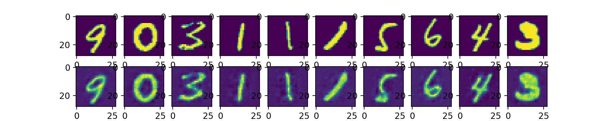

# Общая информация про автоэнкодеры

Виды автоэнкодеров:
* a simple autoencoder based on a fully-connected layer
(простой автоэнкодер основанный на полносвязных слоях)
* a sparse autoencoder (разреженный автоэнкодер)
* a deep fully-connected autoencoder (глубокий полносвязный автоэнкодер)
* a deep convolutional autoencoder (глубоки сверточный автоэнкодер)
* an image denoising model (модель шумоподавления изображений)
* a sequence-to-sequence autoencoder
* a variational autoencoder (вариационный автоэенводер)

## Что такое автоэнкодеры?

"Автоэнкодеры" - это алгоритм сжатия данных, где есть сжимающая и разжимающая
функция
1. Data-specific
2. Lossy (с потерями)
3. Обучается автоматически по примерах (а не под влиянием человека)

Почти везде, где используется термин "автоэнкодер",
сжимающая и разжимающая функция реализована с помощью нейронных сетей.

1. Автоэнкодеры датаспецифичны, это означает, что можно сжимать данные
только похожие на те, на которых происходило обчение. Это отличается от,
например, MPEG-2 Audio Layer III (MP3) сжимающий алгоритм, который работает
со звуком в целом и не учитывает тип звука. Автоэнкодер, который обучался
на картинках с лицами не пригоден для сжатия картинок с деревьями, потому что
автоэнкодер становится лицаспецифичным.

2. Автоэнкодер с потерями - это означает, что разжатые данные хуже, чем
оригинальные входные данных (аналогично mp3 и jpeg сжатию). В отличие от
арифметического сжатия без потерь (lossless arithmetic compression).

3. Автоэнкодер обучается автоматически на примерах, что является полезным
свойством, то есть это легкообучаемый входоспецифичный алгоритм, который
хорошо работает на аналогичных запросах. Никаких дополнительных усилий,
только соответствующая специфике обучающая база.

Для построения автоэенкодера необходимо три вещи:
1. Сжимающую функцию
2. Разжимающую функцию
3. Функцию расстояния потери данных между сжатым представлением и разжатым
("loss" function)

Encoder и decoder будут выбраны в качестве параметрической функции (обычно
нейронные сети) и продифференцированы с функцией расстояния, таким образом
параметры для encoder и decoder будут оптимизированы для минимальных потерь
при реконструкции данных, используя Stochastic Gradient Descent.

## Хорошо ли сживаются данные?

Обычно не очень. На практике для сжатия объекта очень сложно натренировать
автоэенкодер так, чтобы он лучше работал, чем, например, jpeg алгоритм сжатия.
Обычно хороших результатов можно достигнуть только ограничив себя в очень
узкий тип картинок. Факт того, что автоэнкодер очень датаспецифичный делает
его неиспользуемым на практике в реальных задачах в мире: ты можешь использовать
только такие данные, которые похожи на данные, на которых происходило обучение.
Для того, чтобы сделать алгоритм более общим, надо очень много обучающих данных.
Но будущие достижения могут это изменить, кто знает.

## Для чего используется автоэнкодер?

Автоэнкодер используется на практике, например, в 2012 ненадолго они нашли применение
в жадных послойных предобучении для глубокой сверточной нейронной сети, но
это быстро вышло из моды, когда поняли, что схема с инициализацией
рандомными весами сильно лучше для обучения глубоких сетей с нуля. В 2014
пакетная нормализация (batch normalization) дала старт 
и в конце 2015 мы можем обучаться сколь угодно глубоко с нуля, используя
остаточное обучение (residual learning).

Сегодня есть два интересных практических применения автоэнкодоров:
1. Шумоподавление (data denoising) 
2. Сокращение размерности для визуализации данных. С определенной размерностью
и константой разряженности автоэкодер может изучить проекции данных, что
более интересно, чем PCA и другие базовые техники.

Для именно 2d визуализации t-SNE (pronounced "tee-snee") это возможно лучший
алгоритм, но обычно требуются данные с большей размерностью. Таким образом
хорошая стратегия для визуализации данных большой размерности начать с
использования автоэнкодера для сжатия данных в более низкоразмерные
пространства, далее использовать t-SNE для связи между данными и
2D плана.

## Так в чем проблема с автоэенкодером?
Главная причина известности в том, что автоэенкореды были представлены
во многих вводных классах машинного обучения. В результате много новичков
очень любят атоэнкодеры и не могут больше без них. 

Еще одна причина, почему этот алгоритм настолько популярен среди ученых и
привлекает столько внимания, это потому что появилось средство для решения
задачи неконтролируемого обучения, то есть обучение без использования
меток. Опять же автоэнкодер не является настоящей техникой неконтролируемого
обучения (что подразумевает совсем другой процесс обучения), а наоборот,
это контролируемая техника. Специфичные объекты контролируемого обучения, где
результат генерируется по сходным данным. В свою очередь, для того, чтобы
придумать контролируемый процесс, надо придумать интересные искусственные цели
и функцию потерь. Появляются проблемы: только восстановление входных
данных в мельчайших подробностях не может быть нашей задачей. Это важное подтверждение того, 
если сфокусироваться на
восстановлении картинки на уровне пикселей, то это не повлияет благотворно
на машинное обучение.

В контролируемом обучении по картинке применяются автоэнкодеры для
восстановления входной картинки для игрушечных задач, таких как пазлы или
ассоциативные связи картинок (либо большие картинки с мал разрешением, либо
мал картинки с высоким разрешением). Такого рода задачи предоставляют модели
с построением допущений о входных данных, которые упускает традиционный
автоэнкодер, такой как visual macro-structure matters more than pixel-level
details.

# Реализация сверточного автоэнкодера 

В качестве базы используется MNIST. 

После обучения получены следующие результаты: 

Дамп обучения: 

| Итерация | Функция потерь |
|:--------:|:--------------:|
|     0    |    895.51794   |
|     1    |    747.28125   |
|     2    |    695.72595   |
|     3    |    622.57874   |
|     4    |    610.2583    |
|     5    |    575.15594   |
|     6    |    575.7529    |
|     7    |    536.23926   |
|     8    |    527.46216   |
|     9    |    555.32056   |

