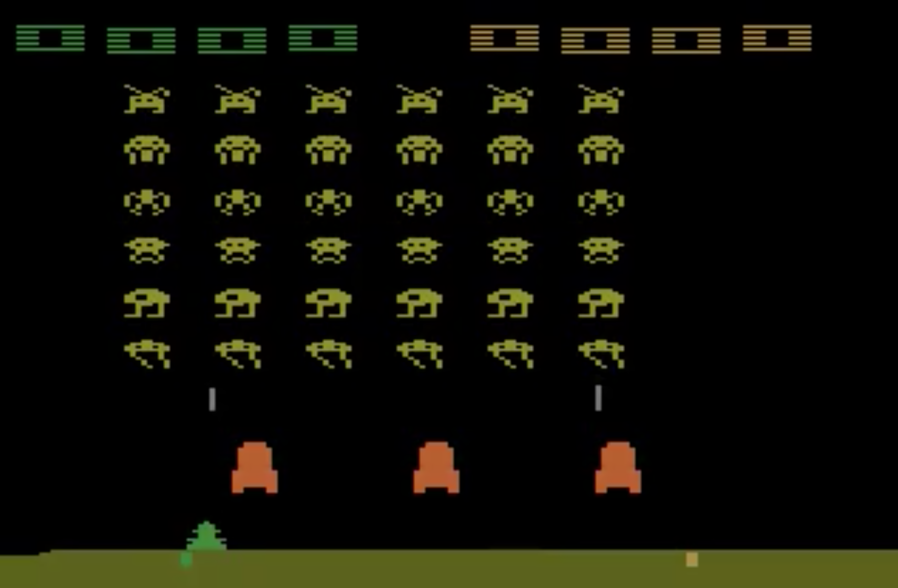
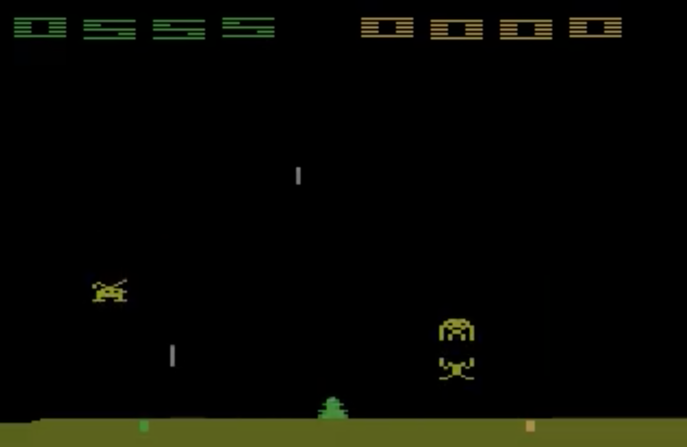
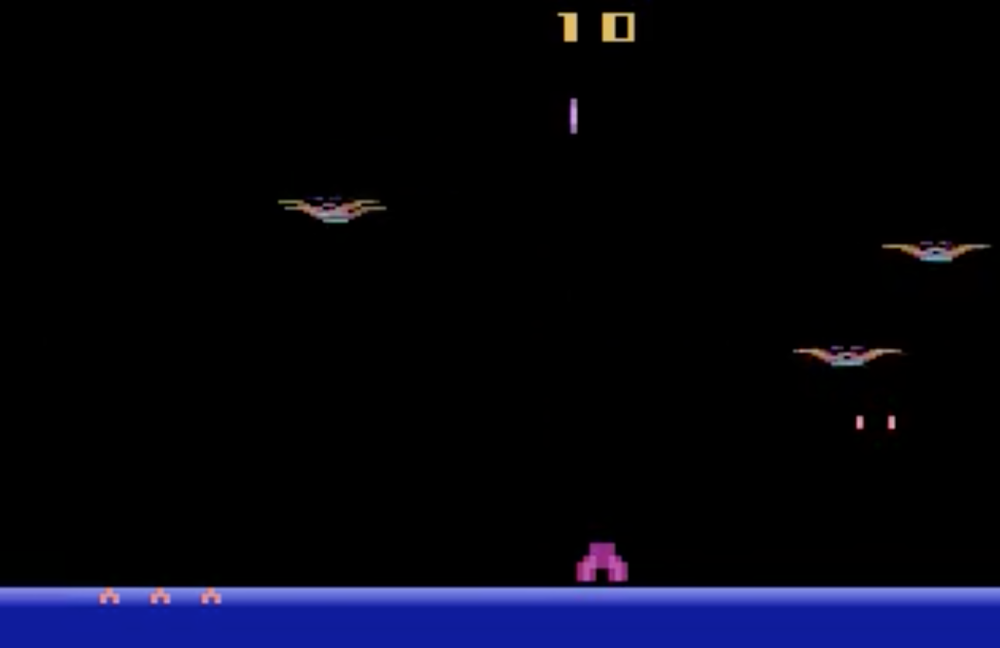
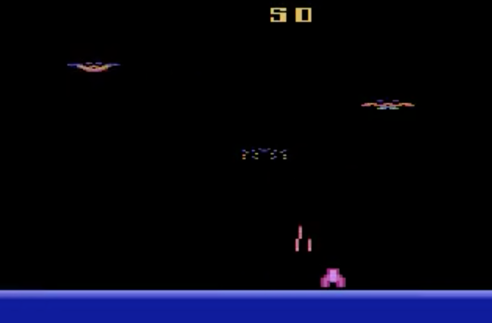

# Эксперименты с Deep Leaning.

Задача: Найти обученную модель и связать с какой-нибудь 
известной темой (например, с игрой Atari).

На выходе надо показать: результат.

## Результат

Обученные модели взяты из репозитория: 
https://github.com/tambetm/simple_dqn/tree/master/snapshots

Доступные модели (после названия идет количество эпох обучения)
* breakout 200
* breakout 77	
* pong 141	
* pong 200	
* seaquest 178	
* seaquest 200	
* space invaders 126	
* space invaders 200	

Для обучения игр Atari использовался репозиторий 
https://github.com/mgbellemare/Arcade-Learning-Environment

В папке `./resources/video` можно найти скринвидео запусков.  

Была выбрана модель - Space Invaders, поскольку есть достаточно много игр 
с похожим геймплеем. 

 
 
Для начала с этой моделью была запущена сама Space Invaders. Результат оказался 
хорошим: почти все враги были уничтожены, до того как жизни героя закончились.
Оставалось 1-5 врагов из 36.  

 

Далее на модели обученной на 200 эпохах на игре Space Invaders была запущена 
игра Demon Attack. Одна достаточно сильно похожа, но враги появляются внезапно
и стреляют не одной пулей, а несколькими. Враги двигаются независимо друг от друга.
Иногда создаются эффекты, которые зашумляют и тем самым, 
скорее всего, ухудшат результат.

Было совершено 5 запусков. Герой обычно держался около от 20 до 38 секунд, вот некоторые 
метрики, которые удалось снять:

Запуск 1, 28 секунд, 4 попадания. 

| Попадания во врага | Промахи во врага | Попадания в героя | Промахи в героя | Появилось врагов | Жизней осталось |
|:------------------:|:----------------:|:-----------------:|:---------------:|:----------------:|:---------------:|
|  3 | 4 | 1 | 5 | 6 | 4 |
| 1 | 1 | 1 | 1 | 0 | 3 |
| 0 | 0 | 1 | 0 | 1 | 2 |
| 0 | 1 | 1 | 1 | 0 | 1 |

Запуск 2, 38 секунд - самый длинный, 4 попадания.

| Попадания во врага | Промахи во врага | Попадания в героя | Промахи в героя | Появилось врагов | Жизней осталось |
|:------------------:|:----------------:|:-----------------:|:---------------:|:----------------:|:---------------:|
|  1 | 2 | 1 | 6 | 4 | 4 |
| 0 | 1 | 1 | 2 | 0 | 3 |
| 2 | 3 | 1 | 4 | 2 | 2 |
| 1 | 3 | 1 | 2 | 1 | 1 |

Запуск 3, 29 секунд, 5 попаданий - самый результативный.

| Попадания во врага | Промахи во врага | Попадания в героя | Промахи в героя | Появилось врагов | Жизней осталось |
|:------------------:|:----------------:|:-----------------:|:---------------:|:----------------:|:---------------:|
|  3 | 5 | 1 | 6 | 6 | 4 |
| 0 | 2 | 1 | 1 | 0 | 3 |
| 1 | 2 | 1 | 1 | 1 | 2 |
| 1 | 0 | 1 | 0 | 1 | 1 |

Запуск 4, 23 секунды, 4 попадания. 

| Попадания во врага | Промахи во врага | Попадания в героя | Промахи в героя | Появилось врагов | Жизней осталось |
|:------------------:|:----------------:|:-----------------:|:---------------:|:----------------:|:---------------:|
|  1 | 2 | 1 | 3 | 4 | 4 |
| 0 | 1 | 1 | 0 | 0 | 3 |
| 3 | 4 | 1 | 3 | 3 | 2 |
| 0 | 2 | 1 | 1 | 0 | 1 |
 
Запуск 5, 20 секунд, 4 попадания
 
| Попадания во врага | Промахи во врага | Попадания в героя | Промахи в героя | Появилось врагов | Жизней осталось |
|:------------------:|:----------------:|:-----------------:|:---------------:|:----------------:|:---------------:|
| 2 | 2 | 1 | 2 | 5 | 4 |
| 1 | 0 | 1 | 0 | 1 | 3 |
| 0 | 1 | 1 | 1 | 0 | 2 |
| 1 | 0 | 1 | 1 | 1 | 1 | 

Прихожу к забавному выводу: после обучения на Space Invaders герой в Demon Attack
играет примерно с таким же успехом, как враги в Demon Attack: стреляет, попадает 
и уворачивается с такой же частотой, как враг. Понятно, что игра при таком 
раскладе долго продолжаться не может :)    

 

 