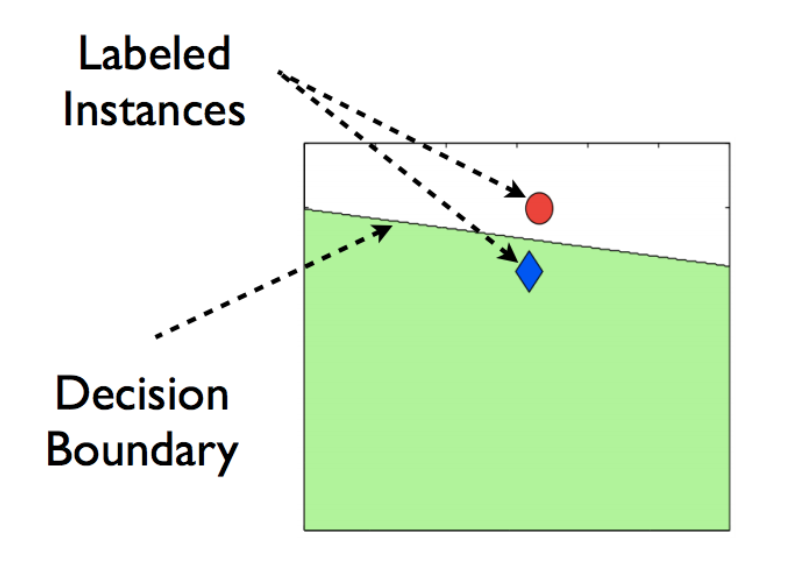
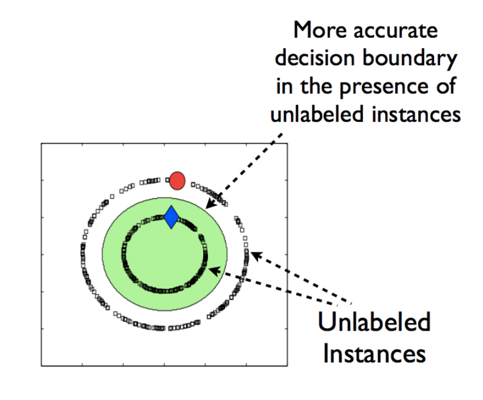
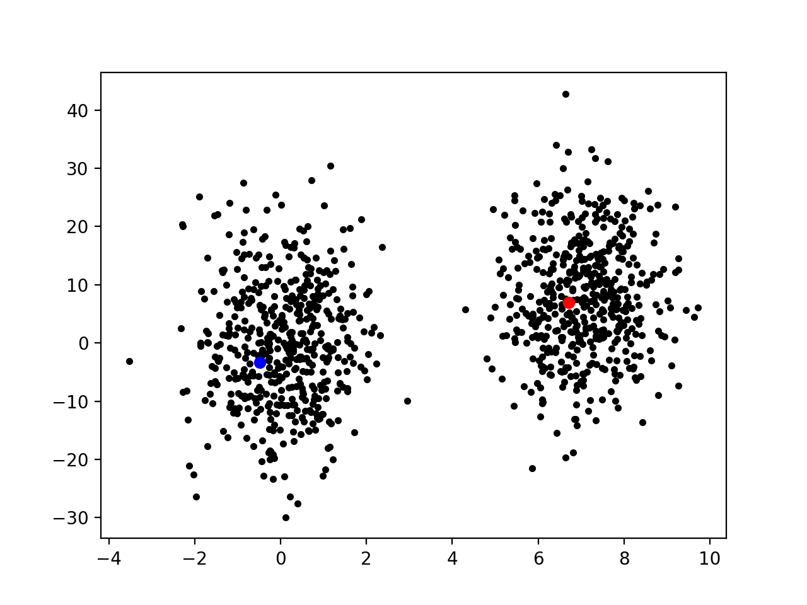

# Обучение по частично размеченным данным.

Задача: Сгенерировать 2 набора точек (2 гауссианы). 
В каждом наборе разметить по 1 точке, используя маргинализацию по 
пропущенным неразмеченным точкам, найти их классы.

Подгонять по правдоподобию.

На выходе надо показать: код, результат, текстовый дамп обучения, Θ

## Общая информация

### Что такое обучение по частично размеченным данным? 

Например, есть задача классификации картинок на два класса:
* Eclipse 
* Non-eclipse 

И так, надо построить модель на учебном наборе состоящем из 
небольшого количества картинок, 
которые имеют метку.

### Как неразмеченные данные могут помочь улучшить нашу модель.

Есть две точки на плоскости, которые относятся к двум разным 
категориям. Проведем прямую между ними - граница классов.

Теперь добавим неразмеченные данные. И заметим, что кривая 
разделяющая границы теперь более точная.

Таким образом, преимущества использования немаркированных данных:
1. Маркированные данные являются дорогостоящими и трудными 
для получения, в то время как немаркированные являются 
доступными и дешевыми.
2. Это улучшает устойчивость модели более точной границей 
между классами. 

### Реализация 

Сгенерируем два множества точек. Выберем по одной точке в каждом множестве 
и поставим разные метки. 

Далее найдем классы для неразмеченных точек.

TODO 

